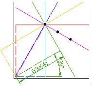

# 霍夫变换检测线
本节主要是演示如何使用opencv中的函数`HoughLines()`与`HoughLinesP()`来检测图像中的线。

## 理论
### 霍夫变换
- 简介：霍夫变换是图像变换的经典手段之一，主要用来提取具有某种几何规律的特征形状（比如直线、圆等）。

- 基本思想：霍夫变换运用**两个坐标空间的变换**将在一个空间中具有相同形状的曲线或直线映射到另一个坐标空间，并在一个点上形成峰值，从而把检测任意形状的问题转化成**统计峰值**的问题。

### 检测线的霍夫变换
1. 本文讲的是检测直线的霍夫变换。当然也还有检测其他集合形状的霍夫变换。
2. 霍夫变换是对边缘点进行的，要使用这个变换，首先需要先进行边缘检测(因为只需要对边缘检测是不是直线)。

- 一般原理：一条直线在直角坐标系下可以用`y=kx+b`来表示。检测直线的霍夫变换主要思想是将该方程的参数与变量关系互换，在另一个坐标空间中，将x，y作为已知量，k，b作为变量坐标，所以每一个图像上的每个点，都可以变成另一个坐标空间中的一条直线。那么在直角坐标系下属于同一条直线`y=kx+b`的点便都在参数空间中交于一点`（k，b）`。如下图:


- 一般情况下，为了计算方便，都是使用**极坐标空间**作为参数空间，因为，一条直角坐标空间的一条直线可以用一个极坐标唯一确定（**倾斜的角度与离原点的距离**）。这样，直角坐标空间的每个点都在极坐标空间里代表一条曲线，直角坐标空间里相同直线上的点在极坐标空间里代表的曲线也相交于一个点。如下图:


## 程序分析（hough_lines.cpp）
1. 加载图片
2. 分别应用`HoughLines()`与`HoughLinesP()`
3. 使用三个窗口显示结果，用于对比。

##  opencv提供的两种检测线的霍夫变换 
1. 标准霍夫变换
在Opencv中由函数`HoughLines()`实现
```cpp
void cv::HoughLines	(	InputArray 	image,
						OutputArray 	lines,
						double 	rho,
						double 	theta,
						int 	threshold,
						double 	srn = 0,
						double 	stn = 0,
						double 	min_theta = 0,
						double 	max_theta = CV_PI 
)
```
---
作用：使用标准霍夫变换从一个二值图像里寻找**直线**
参数含义（其他参数需要自己再看官方文档）：
- image: 	8位、单通道二值源图像，这个图像可能会被函数改变。
- lines：	输出的直线向量，这个向量的每个元素是一个两元素向量，第一个元素代表直线到原点距离，第二个元素代表直线角度。
- rho：		距离参数累加器的距离分辨率
- theta：	角度参数累加器的距离分辨率
- threshold：	阈值，只有当一个参数坐标处相交次数大于阈值时，才会将其放到lines中


2. 概率霍夫线变换
在Opencv中由函数`HoughLinesP()`实现
```cpp
void cv::HoughLinesP	(	InputArray 	image,
							OutputArray 	lines,
							double 	rho,
							double 	theta,
							int 	threshold,
							double 	minLineLength = 0,
							double 	maxLineGap = 0 
)	
```
---
作用：使用概率霍夫变换从一个二值图像里寻找**线段**
参数含义：
- image: 	8位、单通道二值源图像，这个图像可能会被函数改变。
- lines：	输出的直线向量，这个向量的每个元素是一个四元素向量（x1,y1,x2,y2），(x1,y1)和(x2,y2)分别是一个线段的两个端点。
- rho：		距离参数累加器的距离分辨率
- theta：	角度参数累加器的距离分辨率
- threshold：	阈值，只有当一个参数坐标处相交次数大于阈值时，才会将其放到lines中


