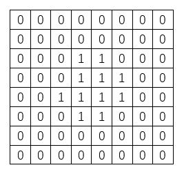
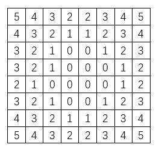

# distance transform
## demo讲解
- 使用opencv距离变换函数进行距离变换操作展示;
- 自定义`480×480`大小二值图像，将三个点`(100,200)(200,100)(300,300)`设置为1,其他点设置为0;
- 分别用欧式距离、D4距离、D8距离进行距离变换，并展示结果;

## 原理
- 距离变换算法：距离变换描述的是图像中像素点与某个区域块的距离，区域块中的像素点值为0,其他区域的像素值为到该区域块的最短距离。图像处理中的一些算法以距离变换为基础，比如分水岭算法。

- 示例：
如下输入一张二值图像，其中元素为1的区域为我们要的区域块;



对其进行距离变换，原本元素为1的位置设置为0,其他位置的元素值为到区域块的距离。如下：



> 注意：其中距离使用D4距离，也叫城市街区距离，它定义为在只允许横向和纵向运动的情况下，从起点到终点的移动步数。可以根据需要选择合适的距离定义，只要满足距离三要素就行。

## opencv实现接口
```
CV_EXPORTS_W void distanceTransform( InputArray src, OutputArray dst,
                                     int distanceType, int maskSize, int dstType=CV_32F);
```
- 参数解释
    - `InputArray src`：输入图像，一般为二值图像；
    - `OutputArray dst`：输出的图像，距离变换结果；
    - `int distanceType`：用于距离变换的距离类型（欧氏距离：DIST_L2 = 2；$D_4$距离：DIST_L1 = 1；$D_8$距离：DIST_C = 3等）；
    - `int mask_size`：距离变换掩模的大小，一般为3或5；
    - `int dstType`：输出图像的数据类型，可以为CV_8U或CV_32F。

## 距离
- 距离三要素：
    - 同一性：D(p,q)大于等于0,当且仅当`p=q`时，`D(p,q)=0`;
    - 对称性：`D(p,q)=D(q,p)`;
    - 三角不等式：`D(p,r)`小于等于`D(p,q)+D(q,r)`;

- 欧式距离：大家都知道

- D4距离：也叫城市街区距离，它定义为在只允许横向和纵向运动的情况下，从起点到终点的移动步数。

- D8距离：也叫棋盘距离，它定义为允许横向、纵向和沿对角线方向移动。
